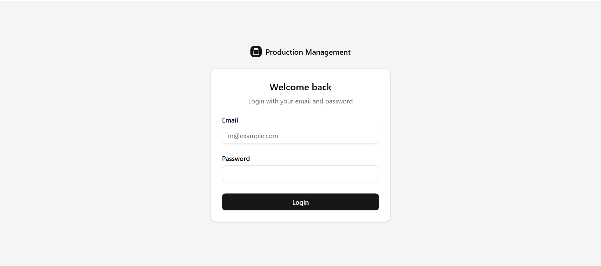
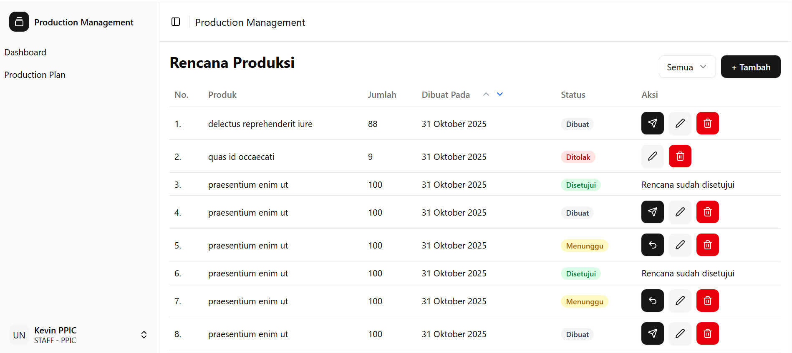
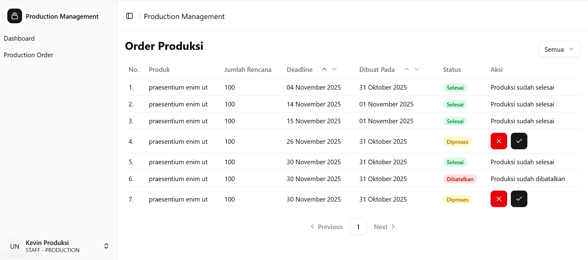
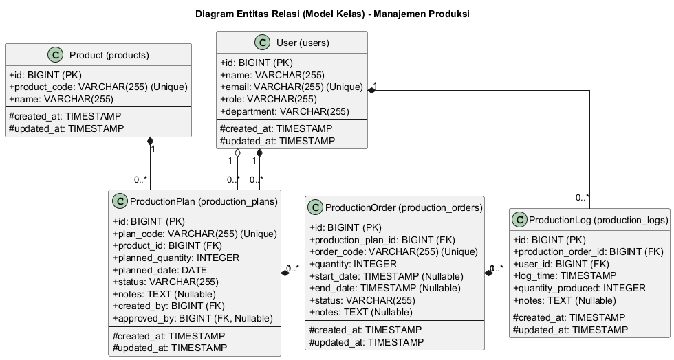

# Production Management Project

This is a full-stack web application project consisting of:

- **Backend (BE):** Built with Laravel
- **Frontend (FE):** Built with Vue.js 3 and Vite

Here is a guide to install and run this project in a local development environment.

## 💻 Prerequisites

Ensure you have the following software installed on your system:

- PHP >= 8.2
- Composer
- Node.js (v18 or newer recommended)
- **PNPM** (This project uses `pnpm` as the package manager)
- Database (e.g., MySQL, MariaDB, or PostgreSQL)

## ⚙️ Installation & Configuration

The installation process is divided into two parts: Backend and Frontend.

---

### 🚀 Backend (Laravel)

1.  Navigate to the backend directory:

    ```bash
    cd be
    ```

2.  Install Composer dependencies:

    ```bash
    composer install
    ```

3.  Copy the `.env.example` file to `.env`:

    ```bash
    cp .env.example .env
    ```

4.  Open the `.env` file and configure your database connection. Create a new database (e.g.,
    `production_management`) and adjust the following lines with your configuration:

    ```env
    DB_CONNECTION=pgsql
    DB_HOST=127.0.0.1
    DB_PORT=5432
    DB_DATABASE=production_management
    DB_USERNAME=postgres
    DB_PASSWORD=
    ```

5.  Generate Laravel Application Key:

    ```bash
    php artisan key:generate
    ```

6.  Generate JWT Secret (This project uses JWT for authentication):

    ```bash
    php artisan jwt:secret
    ```

7.  Run the database migrations to create the tables:

    ```bash
    php artisan migrate
    ```

8.  (Optional) Run the seeders to populate initial data (user data, products, etc.):
    ```bash
    php artisan db:seed
    ```

---

### 🎨 Frontend (Vue + Vite)

1.  Open a **new terminal**, navigate to the frontend directory:

    ```bash
    cd fe
    ```

2.  Install dependencies using `pnpm`:

    ```bash
    pnpm install
    ```

3.  Copy the `.env.example` file to `.env`:

    ```bash
    cp .env.example .env
    ```

4.  Ensure the `.env` file contents are correct. By default, the frontend will connect to the
    backend API at `http://localhost:8000/api`.
    ```env
    VITE_API_URL=http://localhost:8000/api
    ```

## ▶️ Running the Project

You need to run **two servers** simultaneously in two separate terminals.

**1. Running the Backend Server (Terminal 1):**

- Make sure you are in the `be` directory.
  ```bash
  php artisan serve
  ```
- The backend server will run at `http://localhost:8000`.

**2. Running the Frontend Server (Terminal 2):**

- Make sure you are in the `fe` directory.
  ```bash
  pnpm run dev
  ```
- The frontend server will run at `http://localhost:5173` (or another available port).
- Open the frontend URL (e.g., `http://localhost:5173`) in your browser to use the application.

## Screenshots

1. Login



2. Production Plan



3. Production Order



## ERD


